# Shappar アーキテクチャ図集

このドキュメントには、Shapparプロジェクトの各種アーキテクチャ図が含まれています。

## 1. システム全体のアーキテクチャ

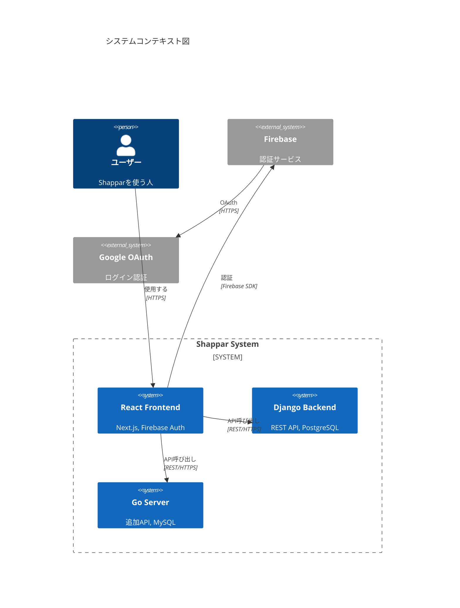

## 2. 現在のフロントエンド構成

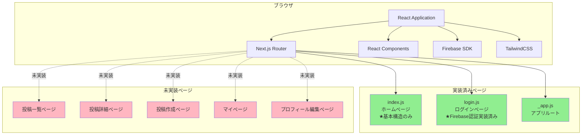

## 3. 認証フロー詳細

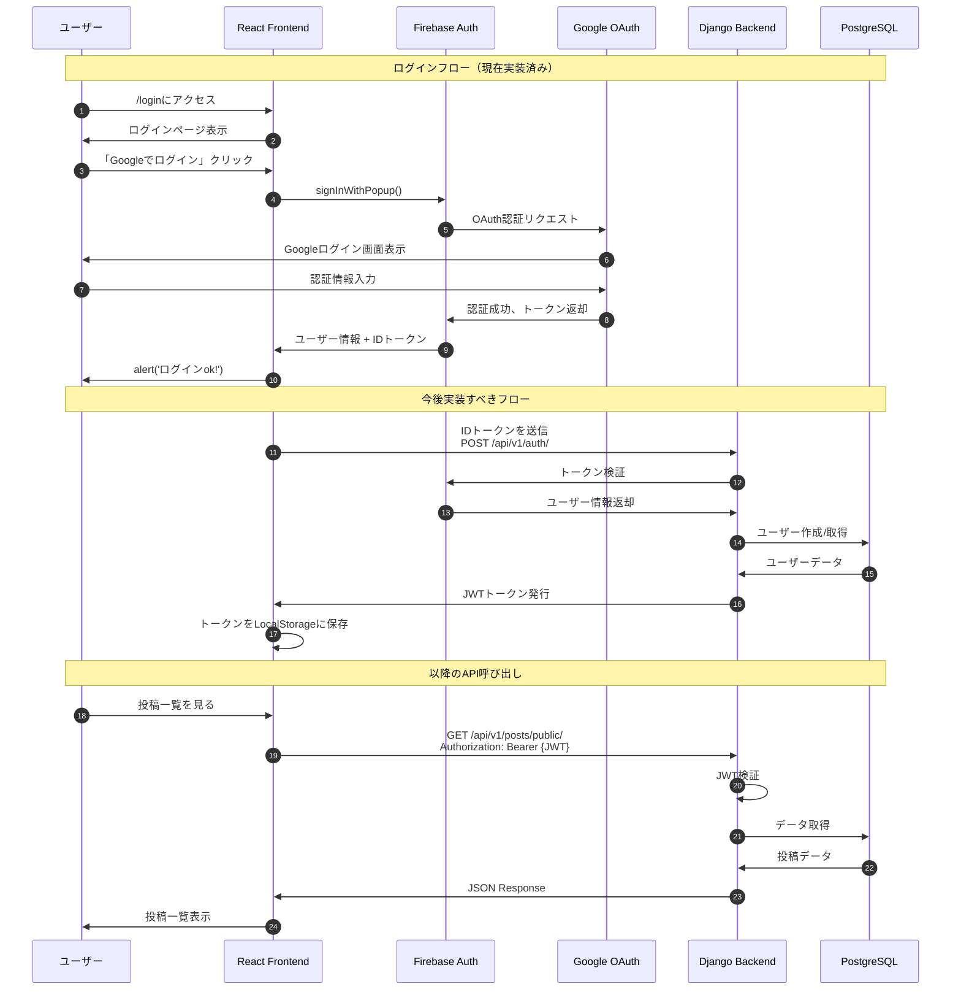

## 4. データフロー図

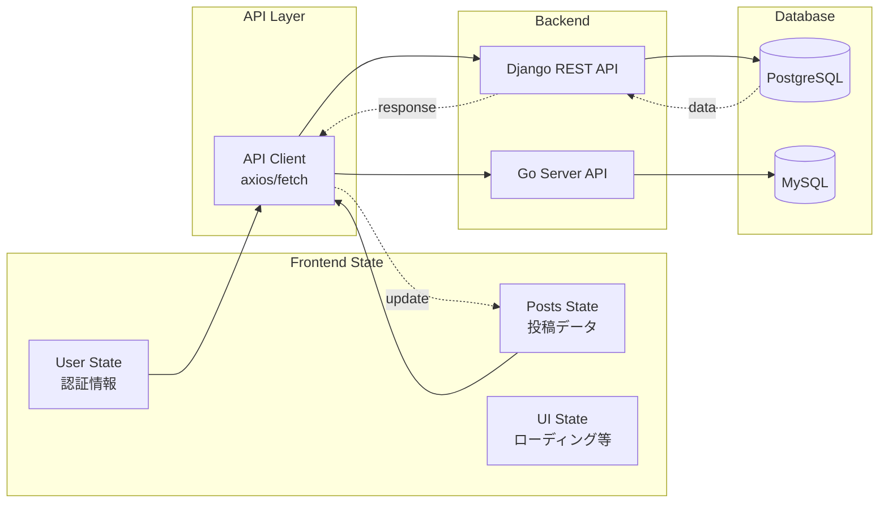

## 5. コンポーネント構成（提案）

```mermaid
graph TD
    subgraph "Pages"
        Page1[pages/index.js]
        Page2[pages/login.js]
        Page3[pages/posts/index.js<br/>未実装]
        Page4[pages/posts/create.js<br/>未実装]
        Page5[pages/posts/[id].js<br/>未実装]
        Page6[pages/mypage/[username].js<br/>未実装]
    end
    
    subgraph "Layout Components"
        L1[Layout]
        L2[Header]
        L3[Footer]
        L4[Sidebar]
    end
    
    subgraph "Feature Components"
        C1[PostList<br/>投稿一覧]
        C2[PostCard<br/>投稿カード]
        C3[PostDetail<br/>投稿詳細]
        C4[VoteButton<br/>投票ボタン]
        C5[VoteResults<br/>投票結果]
        C6[CreatePostForm<br/>投稿作成フォーム]
        C7[UserProfile<br/>ユーザープロフィール]
    end
    
    subgraph "Common Components"
        U1[Button]
        U2[Input]
        U3[Modal]
        U4[Loading]
        U5[ErrorMessage]
    end
    
    Page1 --> L1
    Page2 --> L1
    Page3 --> L1
    Page4 --> L1
    Page5 --> L1
    Page6 --> L1
    
    L1 --> L2
    L1 --> L3
    L1 --> L4
    
    Page3 --> C1
    C1 --> C2
    Page5 --> C3
    Page5 --> C5
    C2 --> C4
    C3 --> C4
    Page4 --> C6
    Page6 --> C7
    
    C1 --> U1
    C2 --> U1
    C6 --> U2
    C3 --> U3
    C1 --> U4
    Page3 --> U5
    
    style Page1 fill:#90EE90
    style Page2 fill:#90EE90
    style Page3 fill:#FFB6C1
    style Page4 fill:#FFB6C1
    style Page5 fill:#FFB6C1
    style Page6 fill:#FFB6C1
```

## 6. バックエンドAPI構造

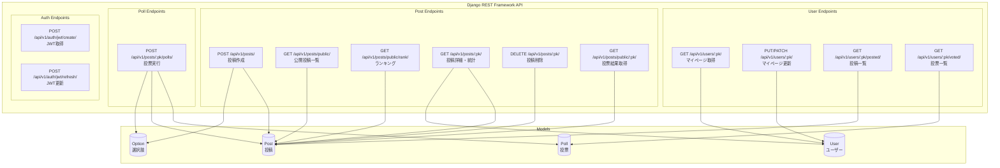

## 7. 実装優先度マトリックス

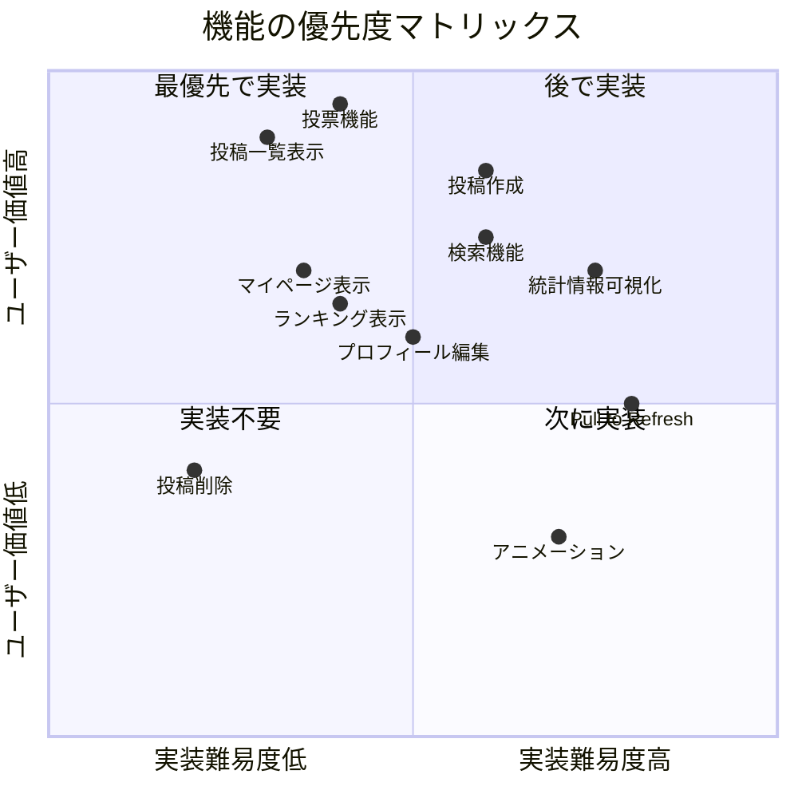

## 8. 技術スタック比較（Vue.js → React）

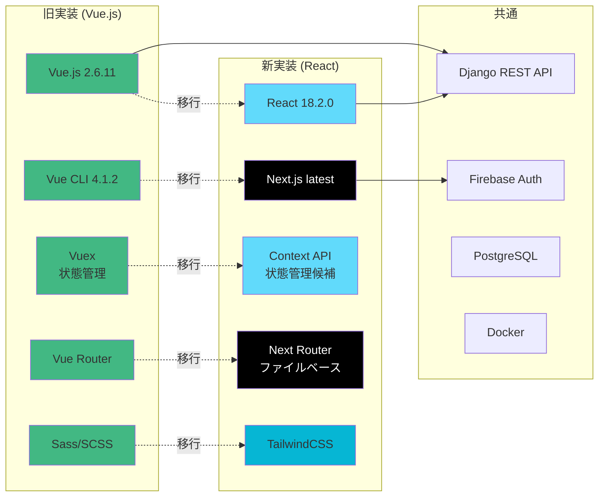

## 9. デプロイメントアーキテクチャ

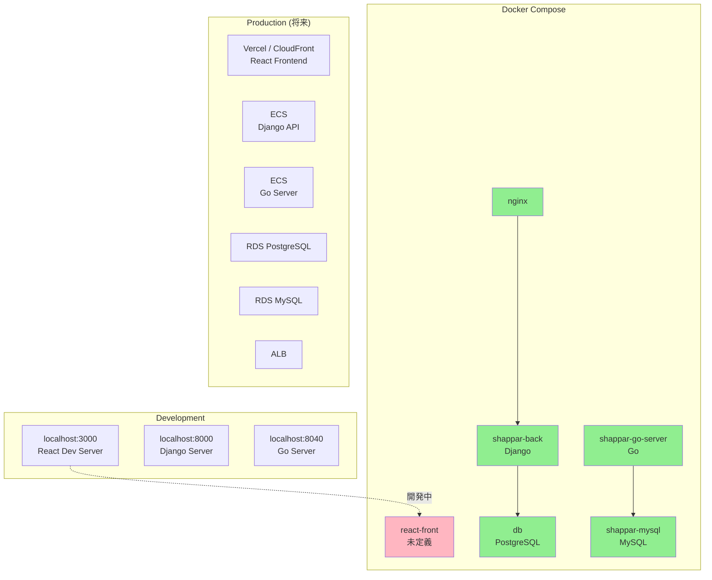

## 10. 開発フロー詳細

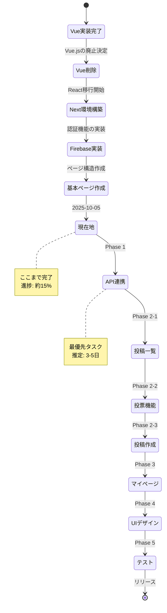

## 11. データベースER図（簡易版）

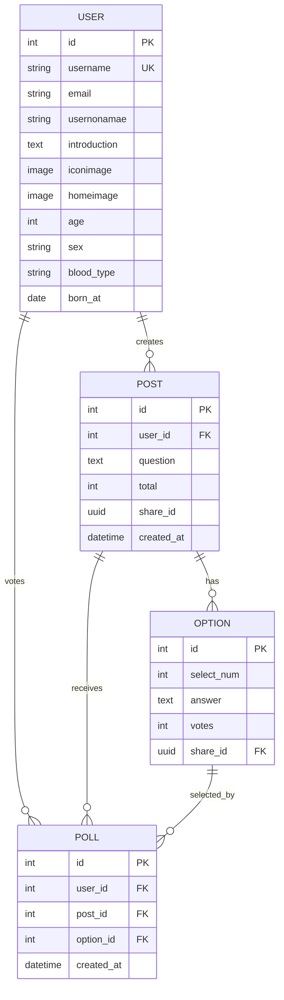

## 12. 実装チェックリスト

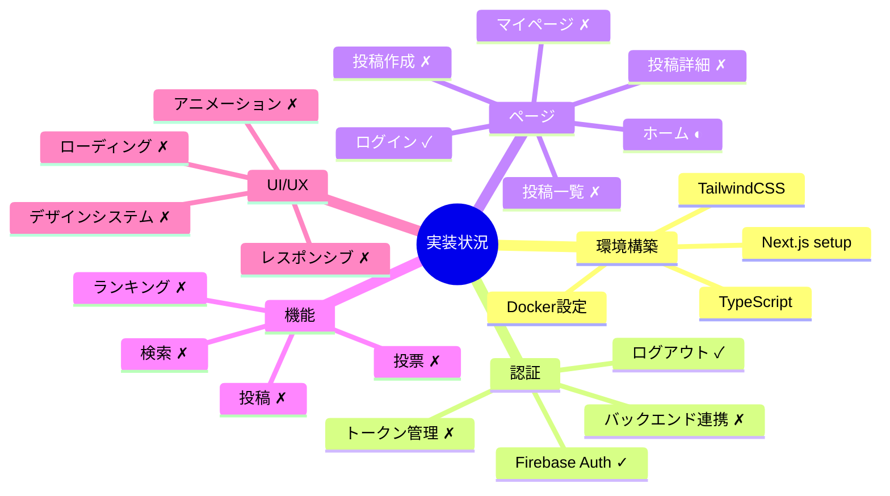

凡例:
- ✓ : 完了
- ◐ : 部分的に完了
- ✗ : 未実装

---

**最終更新日**: 2025-10-05  
**作成者**: Background Agent
