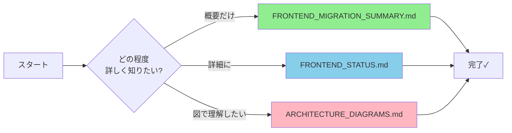

# 📚 Shappar ドキュメント インデックス

このファイルは、Shapparプロジェクトの全ドキュメントへのナビゲーションインデックスです。

## 🎯 Linear Issue SHA-8 対応ドキュメント

Linear Issue **SHA-8: フロントエンドの状況を把握する** に対応して作成されたドキュメント一覧です。

### 新規作成ドキュメント（2025-10-05）

| ドキュメント | 説明 | サイズ | 推奨読者 |
|------------|------|--------|---------|
| **[FRONTEND_MIGRATION_SUMMARY.md](./FRONTEND_MIGRATION_SUMMARY.md)** | 📋 **最初に読むべき** <br/>Vue→React移行の全体サマリー<br/>- 現状の要約<br/>- 進捗率<br/>- 次のステップ<br/>- 実装例 | 13KB | 全員 |
| **[FRONTEND_STATUS.md](./FRONTEND_STATUS.md)** | 📊 詳細な状況分析<br/>- 実装済み機能<br/>- 技術スタック<br/>- API一覧<br/>- ロードマップ | 16KB | 開発者・PM |
| **[ARCHITECTURE_DIAGRAMS.md](./ARCHITECTURE_DIAGRAMS.md)** | 🏗️ アーキテクチャ図集<br/>- システム全体図<br/>- 認証フロー<br/>- コンポーネント設計<br/>- 優先度マトリックス | 13KB | 開発者・設計者 |

### 既存ドキュメント

| ドキュメント | 説明 |
|------------|------|
| **[README.md](./README.md)** | プロジェクト全体の説明<br/>元々のVue.js実装の記録 |
| **[GETTING_STARTED.md](./GETTING_STARTED.md)** | 開発環境のセットアップ手順<br/>Pythonサーバーの起動方法 |

## 🔍 ドキュメント利用ガイド

### 状況を把握したい場合



### 開発を始めたい場合

1. **[GETTING_STARTED.md](./GETTING_STARTED.md)** - 環境セットアップ
2. **[FRONTEND_MIGRATION_SUMMARY.md](./FRONTEND_MIGRATION_SUMMARY.md)** - 実装例を確認
3. **[FRONTEND_STATUS.md](./FRONTEND_STATUS.md)** - 詳細な実装計画を確認
4. **[ARCHITECTURE_DIAGRAMS.md](./ARCHITECTURE_DIAGRAMS.md)** - システム設計を理解

### プロジェクトを説明したい場合

1. **[FRONTEND_MIGRATION_SUMMARY.md](./FRONTEND_MIGRATION_SUMMARY.md)** - 現状と進捗
2. **[ARCHITECTURE_DIAGRAMS.md](./ARCHITECTURE_DIAGRAMS.md)** の図を使用
3. **[README.md](./README.md)** - プロジェクトの背景

## 📊 ドキュメント構成

```
/workspace/
├── 📋 DOCUMENTATION_INDEX.md          ← このファイル (ナビゲーション)
├── 📝 FRONTEND_MIGRATION_SUMMARY.md   ← まずはここから読む!
├── 📊 FRONTEND_STATUS.md              ← 詳細な分析
├── 🏗️ ARCHITECTURE_DIAGRAMS.md       ← 図解集
├── 📖 README.md                       ← プロジェクト全体説明
└── 🚀 GETTING_STARTED.md              ← 環境構築手順
```

## 🎯 ドキュメント別推奨読者

| 役割 | 推奨ドキュメント | 理由 |
|-----|----------------|------|
| **プロジェクトマネージャー** | MIGRATION_SUMMARY → STATUS | 進捗とスケジュールを把握 |
| **フロントエンド開発者** | 全て | 開発に必要な全情報 |
| **バックエンド開発者** | ARCHITECTURE_DIAGRAMS → STATUS | API連携の理解 |
| **UI/UXデザイナー** | MIGRATION_SUMMARY → DIAGRAMS | 実装すべき画面の把握 |
| **新規参加メンバー** | MIGRATION_SUMMARY → README → GETTING_STARTED | プロジェクト理解と環境構築 |

## 📈 各ドキュメントの重要なセクション

### FRONTEND_MIGRATION_SUMMARY.md
- ✅ **現状の要約** - 一目で分かる進捗状況
- 🚀 **次に実装すべきこと** - 優先順位付きタスク
- 💡 **重要な技術的課題** - 解決すべき問題
- 📝 **実装例** - すぐに使えるコード

### FRONTEND_STATUS.md
- 🗂️ **ディレクトリ構造** - ファイル配置の詳細
- 🔌 **バックエンドAPI** - 全エンドポイント一覧
- 📅 **実装ロードマップ** - Ganttチャート付き
- 🔧 **技術的な課題と推奨事項** - 実装ガイド

### ARCHITECTURE_DIAGRAMS.md
- 🏗️ **システム全体のアーキテクチャ** - C4モデル図
- 🔐 **認証フロー詳細** - シーケンス図
- 🧩 **コンポーネント構成** - 設計図
- 📊 **実装優先度マトリックス** - 何から作るべきか
- 🗄️ **データベースER図** - データ構造

## 🔗 関連リソース

### 技術ドキュメント
- [Next.js Documentation](https://nextjs.org/docs)
- [React Documentation](https://react.dev/)
- [Firebase Authentication](https://firebase.google.com/docs/auth)
- [Django REST Framework](https://www.django-rest-framework.org/)
- [TailwindCSS Documentation](https://tailwindcss.com/)

### プロジェクト内のコード
- `/workspace/react-front/` - React フロントエンドコード
- `/workspace/apiv1/` - Django REST API
- `/workspace/go-server/` - Go サーバー

## ⚡ クイックリファレンス

### 現在の状況（一言で）
> **Vue.jsからReactへの移行は開始されたが、基本的なページ構造とFirebase認証以外は未実装。バックエンドAPIは完成しているが、フロントエンドとの連携がゼロ。進捗約15%。**

### 最優先タスク（3つ）
1. 🔴 **API連携基盤の実装** (3-5日)
2. 🔴 **投稿一覧ページの実装** (5日)
3. 🔴 **投票機能の実装** (4日)

### 推定完成時期
**約4-6週間** (1人フルタイム作業の場合)

## 📞 質問がある場合

### よくある質問

**Q: Vue.jsのコードはどこにありますか?**  
A: 既に削除されています。README.mdに元々の実装の記録があります。

**Q: バックエンドAPIは動きますか?**  
A: はい。Django REST APIは完全に実装済みで動作します。GETTING_STARTED.mdを参照してください。

**Q: 何から始めればいいですか?**  
A: FRONTEND_MIGRATION_SUMMARY.mdの「次に実装すべきこと Phase 1」から始めてください。

**Q: デザインはどうすればいいですか?**  
A: README.mdの元々のVue.js実装を参考に、マテリアルデザインベースで実装してください。

**Q: テストは書く必要がありますか?**  
A: バックエンドにはテストがありますが、フロントエンドのテストは現状ありません。余裕があれば追加を推奨します。

## 📅 更新履歴

| 日付 | 更新内容 |
|------|---------|
| 2025-10-05 | 初版作成（Linear Issue SHA-8対応）<br/>- FRONTEND_MIGRATION_SUMMARY.md 作成<br/>- FRONTEND_STATUS.md 作成<br/>- ARCHITECTURE_DIAGRAMS.md 作成<br/>- このインデックスファイル作成 |

---

**最終更新**: 2025-10-05  
**作成者**: Background Agent  
**目的**: Linear Issue SHA-8「フロントエンドの状況を把握する」への対応
