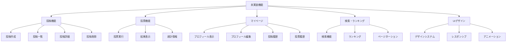
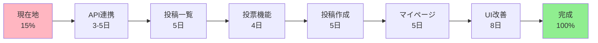

# フロントエンド移行サマリー

## 📋 概要

このドキュメントは、ShapparのフロントエンドをVue.jsからReact (Next.js)への移行状況を簡潔にまとめたものです。

## 📚 ドキュメント一覧

本調査で作成したドキュメント:

1. **[FRONTEND_STATUS.md](./FRONTEND_STATUS.md)** - フロントエンドの詳細な現状分析
   - 実装済み・未実装機能の一覧
   - 技術スタック
   - 実装ロードマップ
   - 推奨される次のステップ

2. **[ARCHITECTURE_DIAGRAMS.md](./ARCHITECTURE_DIAGRAMS.md)** - システムアーキテクチャの図解
   - システム全体図
   - 認証フロー
   - コンポーネント構成
   - データフロー
   - 優先度マトリックス

## 🎯 現状の要約

### ✅ 完了済み (約15%)

```
[████░░░░░░░░░░░░░░░░] 15%
```

| カテゴリ | 状態 | 詳細 |
|---------|------|------|
| 開発環境 | ✅ 100% | Next.js, React, TypeScript, TailwindCSS, Docker |
| 基本認証 | ✅ 80% | Firebase Googleログイン実装済み |
| ページ構造 | ✅ 30% | ホームとログインページの基本構造 |
| API連携 | ❌ 0% | 未実装 |
| コア機能 | ❌ 0% | 投稿・投票機能すべて未実装 |
| UI/UX | ❌ 5% | TailwindCSS設定のみ |

### ❌ 未実装の主要機能



## 🔍 技術スタックの変更

### 旧実装 (Vue.js) → 新実装 (React)

| 項目 | 旧 (Vue.js) | 新 (React) | 状態 |
|-----|------------|-----------|------|
| フレームワーク | Vue.js 2.6.11 | React 18.2.0 | ✅ 移行済み |
| ルーター | Vue Router | Next.js Router | ✅ 移行済み |
| スタイル | Sass/SCSS | TailwindCSS | ✅ 移行済み |
| 状態管理 | Vuex | Context API (予定) | ⏳ 未実装 |
| ビルドツール | Vue CLI | Next.js | ✅ 移行済み |
| 型システム | なし | TypeScript | ✅ 導入済み |

## 📊 実装状況の詳細

### 1. 実装済みファイル

```
react-front/
├── pages/
│   ├── _app.js          ✅ アプリケーションルート
│   ├── index.js         ◐ ホームページ（基本構造のみ）
│   ├── login.js         ✅ Googleログイン完全実装
│   └── api/
│       └── hello.js     ✅ サンプルAPI
├── FirebaseApp.js       ✅ Firebase設定
├── styles/
│   └── globals.css      ✅ グローバルスタイル
├── package.json         ✅ 依存関係管理
├── next.config.js       ✅ Next.js設定
├── tailwind.config.js   ✅ Tailwind設定
└── tsconfig.json        ✅ TypeScript設定
```

### 2. バックエンドAPI（実装済み、フロントエンド未接続）

Django REST APIで以下が実装済み:

```
📍 Users API
  - GET    /api/v1/users/<username>/          # マイページ取得
  - PUT    /api/v1/users/<username>/          # マイページ更新
  - PATCH  /api/v1/users/<username>/          # マイページ部分更新
  - GET    /api/v1/users/<username>/posted/   # 投稿一覧
  - GET    /api/v1/users/<username>/voted/    # 投票履歴

📍 Posts API
  - POST   /api/v1/posts/                     # 投稿作成
  - GET    /api/v1/posts/public/              # 公開投稿一覧
  - GET    /api/v1/posts/public/rank/         # ランキング
  - GET    /api/v1/posts/public/<id>/         # 投票結果取得
  - GET    /api/v1/posts/<id>/                # 投稿詳細・統計
  - DELETE /api/v1/posts/<id>/                # 投稿削除

📍 Polls API
  - POST   /api/v1/posts/<id>/polls/          # 投票実行

📍 Auth API
  - POST   /api/v1/auth/jwt/create/           # JWT取得
  - POST   /api/v1/auth/jwt/refresh/          # JWT更新
```

**重要**: これらのAPIは全て実装済みですが、**フロントエンドからの呼び出しが一切実装されていません**。

## 🚀 次に実装すべきこと（優先順位順）

### Phase 1: API連携基盤 【最優先】
**推定工数**: 3-5日

```javascript
// 1. API通信クライアントの実装
lib/api.js        // axios/fetchのラッパー
lib/auth.js       // 認証トークン管理

// 2. Firebase IDトークンとバックエンドの連携
// 3. エラーハンドリングの統一
// 4. ローディング状態管理
```

### Phase 2: コア機能実装
**推定工数**: 10-15日

```javascript
// 1. 投稿一覧ページ (pages/posts/index.js)
//    - /api/v1/posts/public/ を使用
//    - ページネーション実装
//    - 検索機能

// 2. 投票機能
//    - ワンタップ投票
//    - 即座の結果表示

// 3. 投稿作成ページ (pages/posts/create.js)
//    - フォームバリデーション
//    - 下書き保存
```

### Phase 3: ユーザー機能
**推定工数**: 5-7日

```javascript
// 1. マイページ (pages/mypage/[username].js)
//    - プロフィール表示
//    - 投稿一覧
//    - 投票履歴

// 2. プロフィール編集機能
```

### Phase 4: UI/UXの改善
**推定工数**: 7-10日

```css
/* 1. デザインシステムの構築 */
/* 2. レスポンシブデザイン対応 */
/* 3. アニメーションの追加 */
/* 4. ローディング・エラー表示の改善 */
```

## 💡 重要な技術的課題

### 1. 認証フローの完成

**現状**: Firebase認証のみ実装  
**必要**: Django バックエンドとの連携

```javascript
// 実装が必要なフロー
Firebase Login → IDトークン取得 → Django送信 → JWT取得 → 以降のAPI呼び出しに使用
```

### 2. 状態管理の実装

**推奨**: React Context API または Zustand

管理すべき状態:
- ユーザー認証情報
- 投稿データ
- UI状態

### 3. コンポーネント設計

再利用可能なコンポーネントの作成:
- `<PostCard />` - 投稿カード
- `<VoteButton />` - 投票ボタン
- `<UserAvatar />` - ユーザーアイコン
- `<Loading />` - ローディング表示
- `<ErrorBoundary />` - エラー処理

## 📈 元々のVue.js実装との比較

### Vue.jsで実装されていた機能（全て未移行）

| 機能 | Vue.js | React | 優先度 |
|-----|--------|-------|-------|
| 投稿一覧・ページネーション | ✅ | ❌ | 🔴 最高 |
| Pull to Refresh | ✅ | ❌ | 🟡 中 |
| ワンタップ投票 | ✅ | ❌ | 🔴 最高 |
| 投票結果ソート | ✅ | ❌ | 🟢 低 |
| 投稿作成 | ✅ | ❌ | 🔴 高 |
| 下書き保存 | ✅ | ❌ | 🟡 中 |
| マイページ | ✅ | ❌ | 🔴 高 |
| 検索機能 | ✅ | ❌ | 🟡 中 |
| ランキング | ✅ | ❌ | 🟡 中 |

## 🎨 デザイン要件

元々のVue.js版の特徴を継承すべき点:

1. **マテリアルデザイン**の採用
2. **レスポンシブデザイン**対応
3. **メインカラーとサブカラー**の統一
4. **アイコン中心**のボタンデザイン
5. **シンプルな色使い**

## 📝 実装例

### API呼び出しの例

```javascript
// lib/api.js
import axios from 'axios';
import { getAuth } from 'firebase/auth';

const apiClient = axios.create({
  baseURL: process.env.NEXT_PUBLIC_API_URL || 'http://localhost:8000',
});

// リクエストインターセプター
apiClient.interceptors.request.use(async (config) => {
  const auth = getAuth();
  if (auth.currentUser) {
    const token = await auth.currentUser.getIdToken();
    config.headers.Authorization = `Bearer ${token}`;
  }
  return config;
});

// エラーハンドリング
apiClient.interceptors.response.use(
  response => response,
  error => {
    if (error.response?.status === 401) {
      // ログイン画面にリダイレクト
      window.location.href = '/login';
    }
    return Promise.reject(error);
  }
);

export const api = {
  posts: {
    list: (params) => apiClient.get('/api/v1/posts/public/', { params }),
    create: (data) => apiClient.post('/api/v1/posts/', data),
    detail: (id) => apiClient.get(`/api/v1/posts/${id}/`),
    vote: (id, optionNum) => apiClient.post(`/api/v1/posts/${id}/polls/`, {
      option: { select_num: optionNum }
    }),
    delete: (id) => apiClient.delete(`/api/v1/posts/${id}/`),
  },
  users: {
    mypage: (username) => apiClient.get(`/api/v1/users/${username}/`),
    updateProfile: (username, data) => 
      apiClient.patch(`/api/v1/users/${username}/`, data),
    posted: (username, params) => 
      apiClient.get(`/api/v1/users/${username}/posted/`, { params }),
    voted: (username, params) => 
      apiClient.get(`/api/v1/users/${username}/voted/`, { params }),
  }
};
```

### 投稿一覧ページの実装例

```javascript
// pages/posts/index.js
import { useState, useEffect } from 'react';
import { api } from '../../lib/api';

export default function PostsPage() {
  const [posts, setPosts] = useState([]);
  const [loading, setLoading] = useState(true);
  const [error, setError] = useState(null);

  useEffect(() => {
    const fetchPosts = async () => {
      try {
        setLoading(true);
        const response = await api.posts.list();
        setPosts(response.data.posts || []);
      } catch (err) {
        setError(err.message);
      } finally {
        setLoading(false);
      }
    };

    fetchPosts();
  }, []);

  if (loading) return <div>読み込み中...</div>;
  if (error) return <div>エラー: {error}</div>;

  return (
    <div className="container mx-auto p-4">
      <h1 className="text-2xl font-bold mb-4">投稿一覧</h1>
      <div className="space-y-4">
        {posts.map(post => (
          <PostCard key={post.post_id} post={post} />
        ))}
      </div>
    </div>
  );
}
```

## 📊 進捗トラッキング

### 全体進捗

```
環境構築    [████████████████████] 100%
認証        [████████████████░░░░]  80%
コア機能    [█░░░░░░░░░░░░░░░░░░░]   5%
UI/UX       [█░░░░░░░░░░░░░░░░░░░]   5%
─────────────────────────────────────
総合進捗    [███░░░░░░░░░░░░░░░░░]  15%
```

### 推定残作業時間

| フェーズ | 推定日数 | 優先度 |
|---------|---------|--------|
| Phase 1: API連携 | 3-5日 | 🔴 最高 |
| Phase 2: コア機能 | 10-15日 | 🔴 最高 |
| Phase 3: ユーザー機能 | 5-7日 | 🟡 高 |
| Phase 4: UI/UX | 7-10日 | 🟡 中 |

**合計推定作業時間**: 25-37日（1人フルタイムでの作業を想定）

## 🔗 関連ドキュメント

- [FRONTEND_STATUS.md](./FRONTEND_STATUS.md) - 詳細な状況分析
- [ARCHITECTURE_DIAGRAMS.md](./ARCHITECTURE_DIAGRAMS.md) - アーキテクチャ図集
- [README.md](./README.md) - プロジェクト全体の説明
- [GETTING_STARTED.md](./GETTING_STARTED.md) - 開発環境のセットアップ

## 📞 結論

### 現状まとめ

1. ✅ **環境は整っている**: Next.js, React, TailwindCSS, TypeScript, Docker
2. ✅ **認証の基盤はある**: Firebase認証が動作している
3. ✅ **バックエンドAPIは完成**: Django REST APIが全て実装済み
4. ❌ **フロントエンドの機能実装がほぼゼロ**: ページ構造のみ
5. ❌ **API連携が未実装**: 最大のボトルネック

### 最優先タスク

```
1. APIクライアントの実装 (lib/api.js)
2. 認証トークンの管理とバックエンド連携
3. 投稿一覧ページの実装
4. 投票機能の実装
5. 投稿作成機能の実装
```

### 成功への道筋



**推定完成時期**: 約4-6週間後（1人フルタイムの場合）

---

**作成日**: 2025-10-05  
**作成者**: Background Agent  
**目的**: Linear Issue SHA-8 対応
