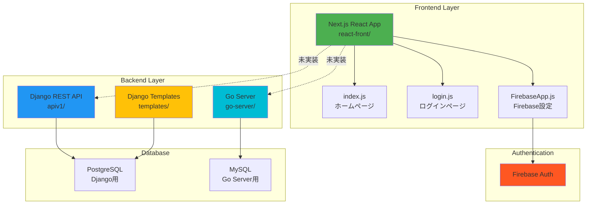
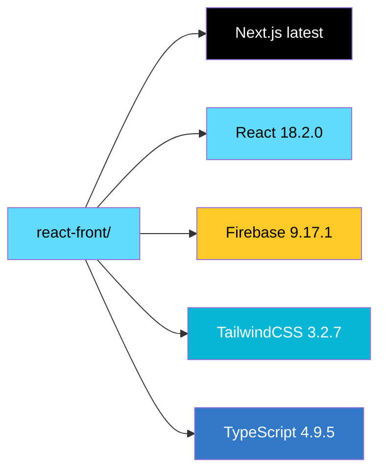
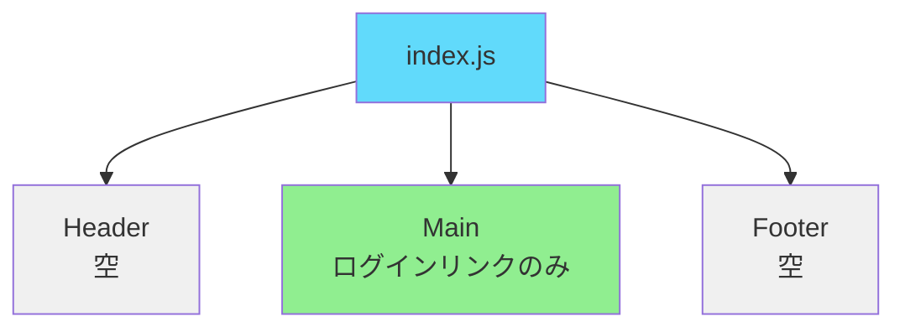
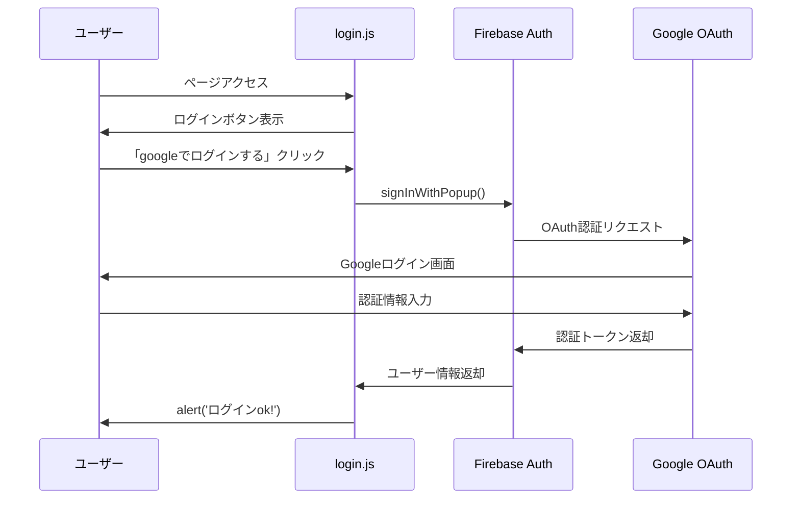
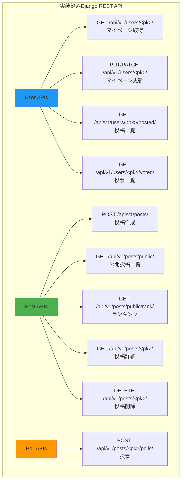
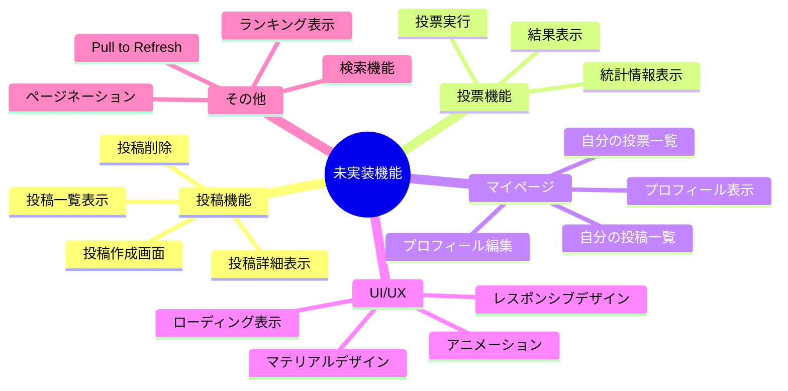
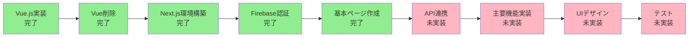
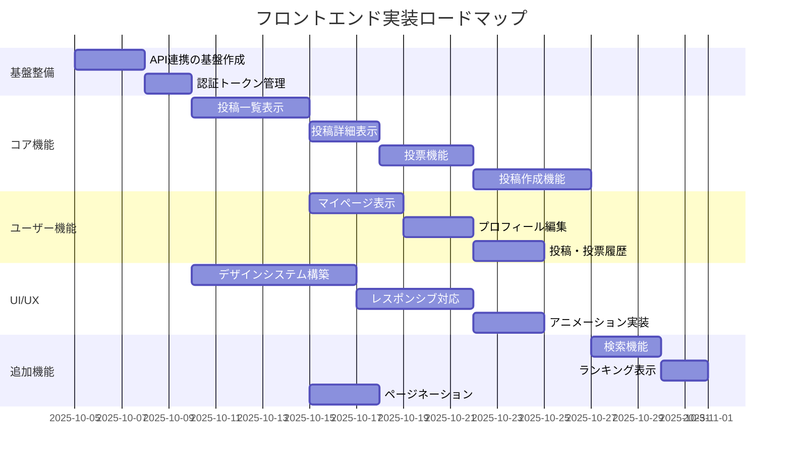
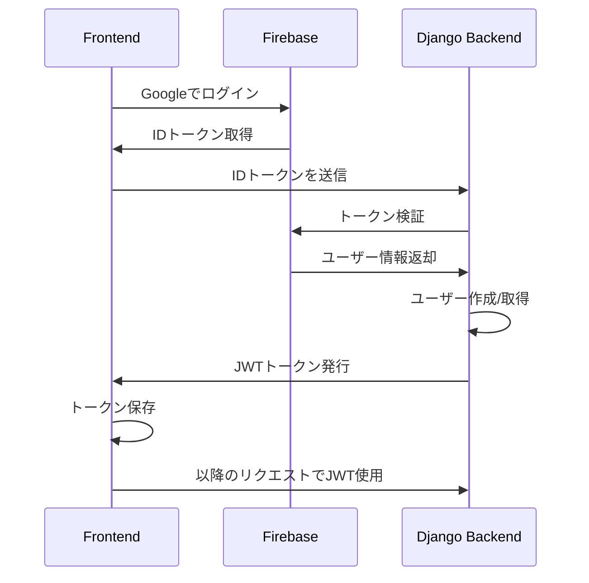

# フロントエンド状況ドキュメント

## 概要

このドキュメントは、Shapparプロジェクトのフロントエンド開発の現状を把握するために作成されました。

## 現在の状況サマリー

### ✅ 完了していること
- **Reactへの移行開始**: Next.jsベースのReactアプリケーションが`react-front`ディレクトリに構築されている
- **Firebase認証の実装**: Googleログイン機能が実装済み
- **基本的なページ構造**: ホームページとログインページが作成されている
- **開発環境の構築**: Docker環境が整っている

### ⚠️ 未完了・進行中のこと
- **Vueからの完全移行**: 元々のVue.jsコードは削除されているが、Reactでの機能実装はまだ初期段階
- **API連携**: バックエンドAPIとの連携が未実装
- **メイン機能の実装**: 投票機能、マイページ、投稿一覧などの主要機能が未実装
- **UI/UXデザイン**: TailwindCSSは導入されているが、デザインはほぼ未実装

## アーキテクチャ概要



## フロントエンド技術スタック

### 現在のReactアプリケーション


### パッケージ構成
| パッケージ | バージョン | 用途 |
|-----------|----------|------|
| next | latest | Reactフレームワーク |
| react | ^18.2.0 | UIライブラリ |
| react-dom | ^18.2.0 | React DOM操作 |
| firebase | ^9.17.1 | 認証・バックエンドサービス |
| tailwindcss | ^3.2.7 | CSSフレームワーク |
| typescript | 4.9.5 | 型安全性 |

## ディレクトリ構造

```
/workspace/
├── react-front/                 # Reactアプリケーション（新規）
│   ├── pages/                   # Next.jsページ
│   │   ├── _app.js             # アプリケーションルート
│   │   ├── index.js            # ホームページ（基本的なリンクのみ）
│   │   ├── login.js            # ログインページ（Firebase認証実装済み）
│   │   └── api/
│   │       └── hello.js        # サンプルAPIルート
│   ├── styles/
│   │   └── globals.css         # グローバルスタイル
│   ├── public/                 # 静的ファイル
│   ├── FirebaseApp.js          # Firebase初期化設定
│   ├── package.json            # 依存関係管理
│   ├── next.config.js          # Next.js設定
│   ├── tailwind.config.js      # Tailwind設定
│   ├── tsconfig.json           # TypeScript設定
│   └── Dockerfile              # Docker設定
│
├── apiv1/                      # Django REST APIバックエンド
│   ├── views.py                # APIビュー（多数実装済み）
│   ├── serializers.py          # シリアライザー
│   ├── urls.py                 # APIエンドポイント
│   └── models.py               # データモデル
│
├── go-server/                  # Goサーバー
│   └── internal/ui/gen/        # Swagger生成コード
│
└── templates/                  # Django テンプレート（旧実装）
    ├── account/                # アカウント関連ページ
    ├── base.html              # ベーステンプレート
    └── home.html              # ホームページ
```

## 実装済みのページ

### 1. ホームページ (`/pages/index.js`)


**実装状況**: 
- ✅ ページ構造のみ
- ❌ コンテンツ未実装
- ❌ デザイン未実装

**コード概要**:
```javascript
// 非常にシンプルな構造
<main>
  <Link href="/login">login</Link>
</main>
```

### 2. ログインページ (`/pages/login.js`)


**実装機能**:
- ✅ Googleログイン
- ✅ ログイン状態確認
- ✅ ログアウト
- ✅ Firebase認証統合
- ❌ エラーハンドリングの改善が必要
- ❌ UIデザイン未実装（素のボタンのみ）

**主要な実装コード**:
```javascript
const doLogin = () => {
  const auth = getAuth();
  setPersistence(auth, browserLocalPersistence)
    .then(() => {
      const provider = new GoogleAuthProvider();
      signInWithPopup(auth, provider)
        .then((result) => {
          alert('ログインok!');
        })
    })
}
```

## バックエンドAPI（実装済み）

以下のAPIエンドポイントはDjango REST Frameworkで実装済みですが、**フロントエンドからの呼び出しは未実装**です。



### 主要APIエンドポイント一覧

| エンドポイント | メソッド | 説明 | フロントエンド実装 |
|--------------|---------|------|------------------|
| `/api/v1/users/<pk>/` | GET | マイページ情報取得 | ❌ |
| `/api/v1/users/<pk>/` | PUT/PATCH | マイページ更新 | ❌ |
| `/api/v1/users/<pk>/posted/` | GET | ユーザーの投稿一覧 | ❌ |
| `/api/v1/users/<pk>/voted/` | GET | ユーザーの投票一覧 | ❌ |
| `/api/v1/posts/` | POST | 新規投稿作成 | ❌ |
| `/api/v1/posts/public/` | GET | 公開投稿一覧（検索・ページネーション） | ❌ |
| `/api/v1/posts/public/rank/` | GET | 投票数ランキング | ❌ |
| `/api/v1/posts/public/<pk>/` | GET | 投稿の投票結果更新取得 | ❌ |
| `/api/v1/posts/<pk>/` | GET | 投稿詳細（統計情報） | ❌ |
| `/api/v1/posts/<pk>/` | DELETE | 投稿削除 | ❌ |
| `/api/v1/posts/<pk>/polls/` | POST | 投票実行 | ❌ |

## 未実装の主要機能



## 開発フロー（現在地）



## 次のステップ（推奨実装順序）



### Phase 1: API連携基盤 (優先度: 最高)

1. **API通信ライブラリの設定**
   - axiosまたはfetchのラッパー作成
   - 認証トークンのインターセプター設定
   - エラーハンドリングの統一

2. **Firebase認証とバックエンドの連携**
   - Firebase IDトークンをバックエンドに送信
   - バックエンド側でトークン検証
   - ユーザーセッション管理

### Phase 2: コア機能実装 (優先度: 高)

1. **投稿一覧画面**
   - `/api/v1/posts/public/` を使用
   - 無限スクロール（ページネーション）
   - 検索機能
   
2. **投票機能**
   - ワンタップ投票
   - 即座の結果表示
   - 統計情報の可視化

3. **投稿作成画面**
   - 質問と選択肢の入力フォーム
   - バリデーション（2-10個の選択肢）
   - 下書き保存（LocalStorage）

### Phase 3: ユーザー機能 (優先度: 中)

1. **マイページ**
   - プロフィール表示・編集
   - 自分の投稿一覧
   - 自分の投票履歴

### Phase 4: UI/UXの改善 (優先度: 中)

1. **デザインシステムの構築**
   - カラースキーム定義
   - コンポーネントライブラリ構築
   - レスポンシブデザイン対応

2. **ユーザー体験の向上**
   - ローディング表示
   - エラーメッセージの改善
   - アニメーション追加

## 技術的な課題と推奨事項

### 1. 認証フロー

**現状の問題**:
- Firebase認証のみで、バックエンドとの連携が未実装
- Djangoの認証システムとの統合が必要

**推奨解決策**:


### 2. 状態管理

**推奨**:
- React Context API（小規模な状態管理）
- または Redux/Zustand（大規模になる場合）

**管理すべき状態**:
- ユーザー認証情報
- 投稿データ
- UI状態（モーダル、ローディングなど）

### 3. APIクライアントの実装例

```javascript
// lib/api.js (例)
import axios from 'axios';
import { getAuth } from 'firebase/auth';

const apiClient = axios.create({
  baseURL: process.env.NEXT_PUBLIC_API_URL || 'http://localhost:8000',
});

apiClient.interceptors.request.use(async (config) => {
  const auth = getAuth();
  if (auth.currentUser) {
    const token = await auth.currentUser.getIdToken();
    config.headers.Authorization = `Bearer ${token}`;
  }
  return config;
});

export const api = {
  posts: {
    list: () => apiClient.get('/api/v1/posts/public/'),
    create: (data) => apiClient.post('/api/v1/posts/', data),
    detail: (id) => apiClient.get(`/api/v1/posts/${id}/`),
    vote: (id, optionNum) => apiClient.post(`/api/v1/posts/${id}/polls/`, {
      option: { select_num: optionNum }
    }),
  },
  users: {
    mypage: (username) => apiClient.get(`/api/v1/users/${username}/`),
    updateProfile: (username, data) => apiClient.patch(`/api/v1/users/${username}/`, data),
  }
};
```

## 元々のVue.js実装について

### Vue.js時代の特徴（README.mdより）

元々は以下の技術スタックで実装されていました:

- **フロントエンド**: Vue.js 2.6.11 + Vue CLI 4.1.2
- **特徴**:
  - SPA (Single Page Application)
  - Vue.js × Django REST Framework
  - S3 + CloudFront で配信
  - マテリアルデザイン
  - レスポンシブデザイン対応

### Vue.jsで実装されていた機能

以下の機能がVue.jsで実装されていましたが、現在のReactアプリでは**未実装**です:

1. **投稿一覧画面**
   - 非同期ページネーション
   - Pull to Refresh
   - 投票機能（ワンタップ）
   - 結果のソート/更新
   - 検索機能
   - ランキング機能

2. **投稿画面**
   - バリデーション
   - 下書き保存（LocalStorage）
   - スライド削除機能

3. **マイページ**
   - プロフィール表示・編集
   - 投稿一覧表示
   - 投票した投稿一覧

**これらの機能を参考にしながら、Reactで再実装する必要があります。**

## まとめ

### 進捗率
- **環境構築**: ✅ 100%
- **認証機能**: ✅ 80% (Firebase実装済み、バックエンド連携が未実装)
- **コア機能**: ❌ 5% (ページ構造のみ)
- **UI/UX**: ❌ 10% (TailwindCSSの設定のみ)

### 総合進捗: 約15%

### 推定作業時間
- **Phase 1 (API連携基盤)**: 3-5日
- **Phase 2 (コア機能)**: 10-15日
- **Phase 3 (ユーザー機能)**: 5-7日
- **Phase 4 (UI/UX)**: 7-10日

**合計**: 約25-37日（1人での作業を想定）

## 参考リンク

- [Next.js Documentation](https://nextjs.org/docs)
- [Firebase Authentication](https://firebase.google.com/docs/auth)
- [Django REST Framework](https://www.django-rest-framework.org/)
- [TailwindCSS](https://tailwindcss.com/)

---

**最終更新日**: 2025-10-05  
**作成者**: Background Agent
