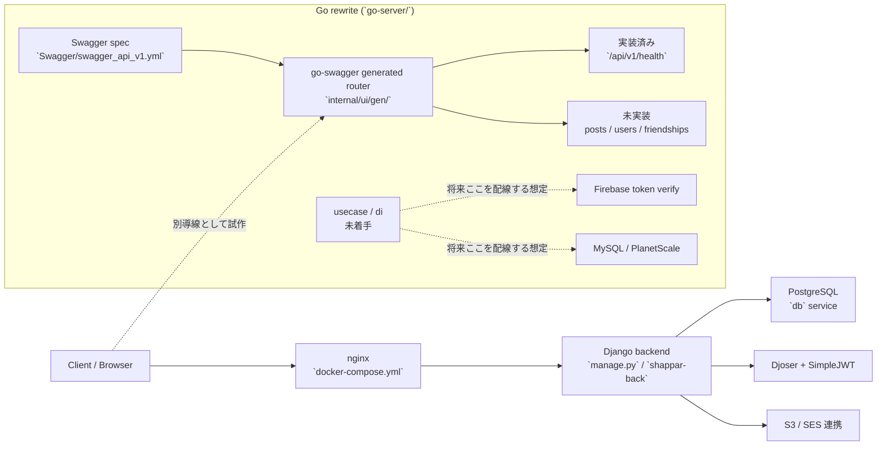

# バックエンド現状メモ

最終確認日: 2026-03-22

## 結論

- リポジトリ内の起動設定を見る限り、現行の主系バックエンドはまだ Django です。
- Go への書き換えは `go-server/` 配下で進められていましたが、現時点で hand-written に実装されている HTTP handler は `/api/v1/health` だけです。
- Go 側で実装済みなのは、Swagger からの API 骨組み生成、health check、Firebase トークン検証、Firebase user 永続化用の MySQL / PlanetScale 周辺です。
- つまり現在地は「Django の本体は残っている」「Go は土台作成と一部周辺実装まで進んだが、主要 API の機能移植は未完了」と整理するのが妥当です。

注記:
この「現行」の判断は、このリポジトリにある起動設定・コード配線からの推定です。実運用が別リポジトリや別 IaC で切り替わっているかどうかまでは、この repo だけでは断定できません。

## どこに何があるか

| パス | 役割 | 現状 |
| --- | --- | --- |
| `manage.py` / `Dockerfile` / `Makefile` | Django バックエンドの起動入口 | 今も root 側の標準起動線 |
| `docker-compose.yml` | ローカル構成 | Django + PostgreSQL + nginx と、別系統の `go-server` + MySQL を同居 |
| `config/` / `accounts/` / `apiv1/` | Django アプリ本体 | 投稿・投票・マイページ・JWT 認証まで実装済み |
| `apiv1/tests/` | Django API テスト | `test_views.py` と `test_serializers.py` が厚い |
| `Swagger/swagger_api_v1.yml` | Go 側の API 仕様 | Django 系 API をベースにした移行先仕様 |
| `go-server/internal/ui/gen/` | go-swagger 生成コード | API の型・routing 骨組みのみ |
| `go-server/internal/ui/server.go` | Go の手書き UI 配線 | `health` handler のみ登録 |
| `go-server/internal/domain/firebaseuser` | Go のドメイン層 | Firebase user 関連のみ存在 |
| `go-server/internal/infrastructure/...` | Go のインフラ層 | Firebase / PlanetScale / SQLC / migration を一部実装 |
| `go-server/internal/usecase` / `go-server/internal/di` | Go のユースケース / DI | まだ空 (`.gitkeep` のみ) |

## Django 側で確認できたこと

### 起動と構成

- root の `Dockerfile` は Python ベースで Django を起動する前提です。
- root の `Makefile` も `runserver`、`migrate`、`test` など Django 用コマンドだけを提供しています。
- `docker-compose.yml` では `shappar-back` が `manage.py migrate` の後に `runserver` を起動し、`nginx` も `shappar-back` に依存しています。
- `config/urls.py` では `/api/v1/` が Django 側の `apiv1.urls` に接続されています。
- `config/settings/local.py` / `product.py` / `circleci.py` には Django REST Framework と SimpleJWT の設定があります。
- DB は Django 側が PostgreSQL、Go 側が MySQL で、同じストレージを共有する構成にはなっていません。

### 実装済みの API / モデル

- `apiv1/urls.py` では以下の API を公開しています。
  - ユーザー詳細 / 更新
  - 自分の投稿一覧 / 投票一覧
  - 投稿作成
  - 公開投稿一覧
  - ランキング一覧
  - 投稿詳細 / 削除
  - 投票作成
  - Djoser / JWT 認証
- `accounts/models.py` には拡張ユーザー `CustomUser` があります。
- `apiv1/models.py` には `Post`、`Option`、`Poll` があり、Shappar の主要投票機能は Django モデルとして成立しています。

### テストの厚み

- Django 側は `apiv1/tests/test_views.py` が 1589 行、`apiv1/tests/test_serializers.py` が 491 行あります。
- これは「古いが実機能がまとまっている本体」は Django 側であることの強い根拠です。

## Go 側で確認できたこと

### 進んでいる部分

- `go-server/cmd/go-server/main.go` から Go サーバーを単独起動できます。
- `Swagger/swagger_api_v1.yml` には以下の API が定義されています。
  - posts
  - users
  - friendships
  - health
- `go-server/internal/ui/gen/` には go-swagger 生成コードがあり、API の型や router は一通り出力されています。
- `go-server/internal/ui/server.go` では `AdministrationsGetAPIV1HealthHandler` だけを hand-written で上書きしています。
- `go-server/internal/domain/firebaseuser` と `go-server/internal/infrastructure/firebaseuserinfrastructure` には、Firebase ID token 検証と Firebase user 永続化のためのドメイン / repository 実装があります。
- `go-server/internal/infrastructure/migration/schema/` には `firebase_user` と `firebase_token_verify` の migration があります。
- `go-server/Makefile` には `run`、`test`、`migrate-up`、`sqlc-gen` など、開発基盤用のコマンドがあります。

### まだ未完了の部分

- `go-server/internal/ui/gen/restapiv1/operations/shappar_api.go` では、health 以外の handler がすべて `middleware.NotImplemented(...)` の初期値です。
- `go-server/internal/usecase` と `go-server/internal/di` は空で、UI から usecase / repository までの本配線がまだありません。
- `go-server/internal/infrastructure/migration/` にあるテーブルは Firebase user 系だけで、Django 側の `Post` / `Option` / `Poll` に対応する移行先スキーマは確認できませんでした。
- Go 側テストは health check と Firebase user repository 周辺が中心で、posts / users / friendships の業務 API テストはありません。
- `docker-compose.yml` では Go サーバーは `8040` 番ポートで別公開されるだけで、`nginx` や Django の既存導線にはまだ接続されていません。

## Django と Go の対応差分

| 観点 | Django | Go |
| --- | --- | --- |
| HTTP 入口 | `manage.py` と compose から起動 | 単独起動はできる |
| 主要 API | 実装済み | Swagger 定義はあるが未配線が大半 |
| 投稿 / 投票機能 | 実装済み | 未実装 |
| 認証 | Djoser + SimpleJWT | Firebase token 周辺のみ一部実装 |
| 永続化 | PostgreSQL 前提 | MySQL / PlanetScale 前提 |
| テスト | API / serializer が厚い | health + Firebase user 周辺のみ |
| 移行完了度 | 現行本体 | 骨組み + 周辺部品の段階 |

## 履歴から見える流れ

- Django 系の主要実装は 2020-05 から 2021-09 にかけて積み上がっています。
- `go-server/` は 2022-11-25 に追加され、2022-12 に Swagger 生成と health check、2023-01 に docker / migration / SQLC、2023-02 に Firebase user 永続化まで進んでいます。
- `go-server/` の直近更新は 2026-03-21 の依存更新 (`google.golang.org/grpc`) ですが、主要 API の実装追加ではありません。

この履歴から、Go 化は 2022-11 から 2023-02 に集中的に進められ、その後は大きく前進していない可能性が高いです。

## 現在地の判定

現時点の整理:

1. 既存サービス本体は Django 側に残っている。
2. Go 側は「全面移行後の本番 backend」ではなく、「新 backend の土台と一部認証 / 永続化基盤を作った段階」。
3. 特に未完了なのは、posts / polls / users / friendships の handler 実装、usecase / DI 配線、Django データモデルとの移行戦略です。
4. そのため、repo から見える現在地は「Go に書き換え中だったが、機能移植は途中で止まっている」に近いです。

## フロー図

## ひとことで言うと

「Django の backend はまだ残っている。Go は health check と Firebase user 周辺の基礎実装まではあるが、主要 API の移植は未完了」です。
