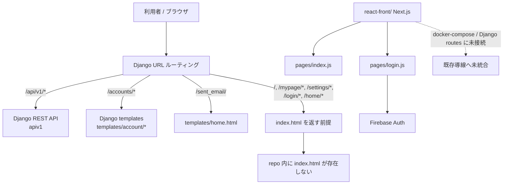

# フロントエンド現状把握

## 結論

- 元々の Vue SPA は README 上では前提として残っているが、現行 repo には Vue の実装ファイルやビルド設定が存在しない
- React への書き換えは `react-front/` で着手されているが、現状は Next.js のひな形に近い構成と Firebase ログイン試作がある段階で、既存アプリ全体の置き換えには至っていない
- Django 側は SPA を返す前提のルーティングをまだ持っている一方で、その受け皿である `index.html` は repo 内に存在しない
- そのため、現在の repo 上のフロントエンドは「Vue 本体は消えている」「React は分離した試作段階」「本体導線は未統合」という状態

## 調査対象

- `README.md`
- `config/urls.py`
- `config/views.py`
- `templates/`
- `accounts/`
- `react-front/`
- `docker-compose.yml`
- `Makefile`

## 現状サマリ

### 1. 旧 Vue 構成はドキュメント上にだけ残っている

`README.md` には以下の説明が残っている。

- Vue.js 2.6.11
- Vue CLI 4.1.2
- Storybook
- Vue.js x Django REST Framework の SPA
- VueCLI でビルドした静的ファイルを S3 / CloudFront に配置

一方で、repo 内には以下が見当たらない。

- `.vue` ファイル
- `vue.config.js`
- Vue 用の `package.json`
- Storybook 設定
- Vue のビルド成果物

このため、README が説明している Vue フロントは、少なくともこの repo では再現できない。

### 2. Django はまだ「SPA を配る側」の前提を持っている

`config/urls.py` では以下のルートが `TemplateView(template_name='index.html')` に向いている。

- `/`
- `/mypage/*`
- `/settings/*`
- `/login/*`
- `/home/*`

これは、もともとの SPA ルーティングを Django が受けて `index.html` を返す構成だったことを示している。

ただし、repo 内に `templates/index.html` は存在しない。つまり、Django 側には SPA を返す前提だけが残っており、実体のテンプレートは欠けている。

また、`templates/base.html` と `templates/home.html` は `static/css/style.min.css` を参照しているが、そのファイルも repo 内では確認できなかった。旧フロントの静的成果物や配信方法が失われている可能性が高い。

### 3. React 版は `react-front/` に分離して存在する

`react-front/package.json` から、現在の React 実装は Next.js ベースで管理されている。

- `next`
- `react`
- `react-dom`
- `firebase`

構成はかなり小さく、現時点で確認できた画面は以下のみ。

- `react-front/pages/index.js`
  - `/login` へのリンクだけを持つトップページ
- `react-front/pages/login.js`
  - Firebase Auth の Google ログイン、ログイン確認、ログアウト

`react-front/README.md` も Next.js のサンプル README がほぼそのまま残っている。また、`react-front/.env.example` は Firebase 向けの環境変数だけを持ち、`react-front/Dockerfile` も単体で Next.js を build/run する内容になっている。つまり `react-front/` は既存 Django 配信導線に繋がった本番フロントというより、独立した試作ディレクトリとして置かれている。

### 4. React 版はローカル実行導線にまだ乗っていない

ルートの `docker-compose.yml` には以下のサービスはある。

- Django (`shappar-back`)
- PostgreSQL (`db`)
- Go server (`shappar-go-server`)
- MySQL (`shappar-mysql`)
- nginx

一方で `react-front/` を起動する service は存在しない。

`Makefile` にも React / Next.js 用の起動コマンドはなく、Django 管理コマンドだけが定義されている。

つまり、repo のメインの開発導線はまだバックエンド寄りで、React フロントは分離して置かれているだけの状態。

### 5. サーバーレンダリングの画面は一部残っている

完全に React へ置き換わった状態ではなく、Django テンプレートもまだ生きている。

- `templates/account/*.html`
  - allauth ベースのログイン、パスワード再設定など
- `templates/home.html`
  - サインアップ直後のメール確認促進画面
- `templates/account/create_user.html`
  - 管理向けのユーザー自動作成画面

`accounts/urls.py` と `config/views.py` を見る限り、認証まわりや一部補助画面は Django テンプレートが担当し続けている。

## React 移行の進捗評価

### できていること

- React / Next.js プロジェクトが repo 内に作られている
- Firebase を使った Google ログインの試作がある
- Dockerfile もあり、`react-front/` 単体ではコンテナ化を想定している

### まだできていないこと

- 旧 Vue からどの画面が移行済みかを示す実装は見当たらない
- 投稿一覧、投稿作成、マイページ、設定など README にある主要画面は React 側で未確認
- Django のルーティングと `react-front/` の接続がない
- `docker-compose.yml` や `Makefile` に React 実行導線がない
- SPA の入口として期待される `index.html` が repo にない

### 現在地の判断

現状は「Vue 版が残っている」のではなく、「Vue 版の説明と前提だけが残り、実体は repo から外れている」状態に近い。そこに対して `react-front/` が新しく作られているが、まだログイン試作レベルで、アプリ本体を置き換える段階までは進んでいない。

## 現在地フロー図

## いま把握できるフロントエンド責務

| 領域 | 現状 | 進捗の見方 | 根拠 |
| --- | --- | --- | --- |
| 旧メイン SPA | 実体不明 / repo には不在 | README の説明だけ残っており、実装確認はできない | `README.md` には Vue 記述があるが、Vue 実装が無い |
| Django 直配信 SPA 導線 | 前提だけ残存 | URL は残っているが、入口テンプレートが欠けている | `config/urls.py` が `index.html` を返す一方、repo に `index.html` が無い |
| 認証系テンプレート | 生存 | 一部画面はまだ Django テンプレートで成立している | `templates/account/*`, `accounts/urls.py`, `templates/home.html` |
| React 置き換え | 着手済みだが限定的 | Next.js プロジェクト作成と Firebase ログイン試作まで | `react-front/pages/index.js`, `react-front/pages/login.js`, `react-front/FirebaseApp.js` |
| React の統合運用 | 未着手 | 開発導線やサーバー接続にまだ入っていない | `docker-compose.yml`, `Makefile` に組み込み無し |

## repo 外で不明な点

- 旧 Vue 資産が別 repo / 別ブランチ / S3 配信物としてだけ残っているのかは、この repo 単体では判断できない
- `config/urls.py` が期待している `index.html` が、過去のビルド生成物なのか、別デプロイ経路から供給される前提なのかは不明
- `react-front/` が将来の本命フロントなのか、単独検証用のプロトタイプなのかを示す設計メモや移行計画は repo 内では確認できなかった

## 補足

この repo だけを見る限り、「Vue から React へ書き換えが進行している」というより、「旧 Vue 資産が repo から抜け落ちたあとに、別ディレクトリで Next.js を立ち上げ始めた」状態に見える。移行の途中という理解は妥当だが、repo 内で確認できる進捗は「React プロジェクト作成とログイン試作」までで、既存導線との統合はまだかなり手前にある。
